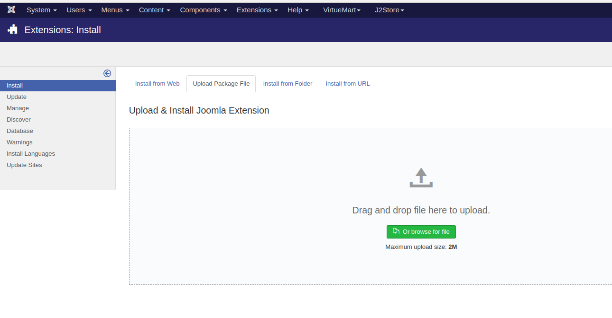
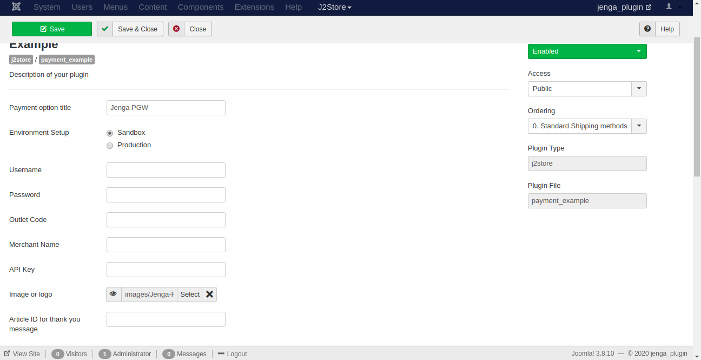

## App Name :
jengapgw-joomla

## Table of Contents
1. Synopsis
2. Collaborators
3. Language
4. Behavior Driven Development
5. Set Up and Installation
6. Contributing
7. Technologies used
8. Known Bugs
9. Licence

### Synopsis
Since Joomla E-commerce site does not provide a payment plattform that supports local payment options available in Kenya,most merchants have a hard time trying to intergrate payments using the local payment solutions. The Jengapgw- joomla  application is a plugin to solve this problem.It  allows Joomla Merchants be able to receive payment on their Equity accounts andbuyers checkout using their Equity bank through the Jenga Payment Gateway API.

### Collaborators
* [Erick Gichimu](https://github.com/Gichimu)
* [Job Musembi](https://github.com/JobMusembi)
* [Joyce Nyakinyua](https://github.com/Nyakinyua)
* [Leon Bichanga](https://github.com/Bchizi)
* [Sam Wendo](https://github.com/Samwendo)
* [Virginiah Periah](https://github.com/virginiah894)

### Language
English

### Behavior Driven Development
1. Merchants- Merchants are able to set-up the Jenga payment option by configuring this plugin on their store in Joomla account.
2. Buyers-After shopping ,a customer is able to check-out  with Jenga.Once the button is clicked,there is a redirection to the Jenga Payment Plugin where they are prompted to select payment option of their choice and put up the equity account details.

### Set Up and Installation
 As a merchant in Joomla , Here is a step by step guide on how to install this plugin on your J2 store.
#### Jenga HQ credentials
 1. Sign Up for a test account in Jenga HQ Portal [here](https://test.jengahq.io/#!/authenticate)

 You will be prompted to fill your personal and business details.After verification,your credentials will be sent to you on email. I.e Username,Merchant Name and Merchant Code.
2. Using your email and password,login to the jenga hq
3. Go to the overview menu and select your currency(You can select more than one currency).
4. Check your API keys.copy or save the credentials because they will be used in your store configuration. 

#### Joomla-J2 store
prerequisites:
  * LAMP or XAMPP

Assumptions:
You have fully installed Joomla Site and onfigured J2 store. If not, follow this links to download  joomla and j2 store configurations.
* [joomla on ubuntu](https://hostadvice.com/how-to/how-to-install-joomla-on-an-ubuntu-18-04-vps-or-dedicated-server/)
* [joomla on windows](https://websiteforstudents.com/install-joomla-cms-on-windows-10-desktop-server-with-xampp-support/)

 - To install j2 store : Navigate to the administrator side of your Joomla store > go to extensions drop-down > click on manage > navigate to install>click install from web and search J2 store then click install.
 - On the J2 store drop down,click on dashboard to  Configure the basic settings and enable J2 store.[read more](https://docs.j2store.org/)

 #### Intergrating the jengapgw-joomla plugin
 1. Clone this repository by running this command on your terminal 
 [git clone https://github.com/Gichimu/jengapgw-joomla.git]
 2. Compress the folder.The folder **MUST** be compressed.
 3. On the navigation click on Extensions > manage > install > and click on Upload Package and select your zip folder.

 4. The payment option will be available and all the merchant needs to do is fill in the form with the credentials from the Jenga HQ portal.
 - The form looks like this.
 
 5. After filling the form selcet the enabled drop-down on the right and select save.
 6.The  jengapgw-joomla checkout will be available on your store.

### Contributing
The developer's team invites pull requests for major changes.If interested,please open an issue first to discuss what you would like to change and ensure your tests are appropriate.
 ##### Contributing proccess
 * Git clone this repository and create your won branch:
[git checkout https://github.com/Gichimu/jengapgw-joomla.git-bname_for_new_branch]
* Make changes and test them.
* Submit Pull Request with comprehensive details of  the changes
### Technologies used
  * Vanilla PHP
  * Joomla CMS
  * XML
  * HTML
### Known Bugs
 There are no known bugs.However, if you encounter any bug while installing or configuring the plugin on your shop,Create an issue with the task you were doing and expected outcome.Our team will pick it up.

## License
[MIT](https://github.com/Gichimu/jengapgw-joomla/blob/master/LICENSE)

